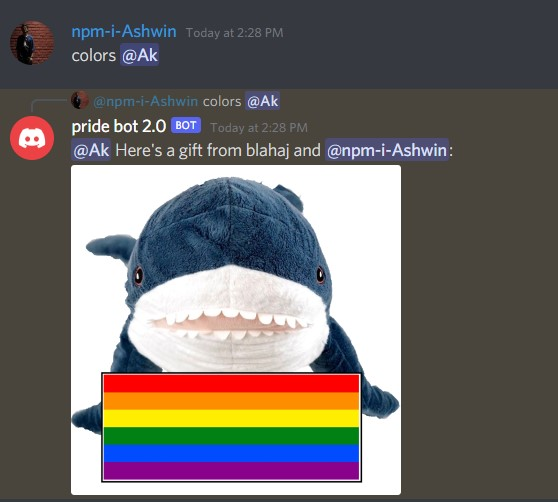
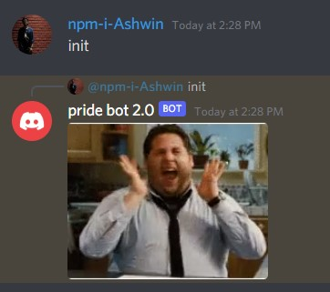
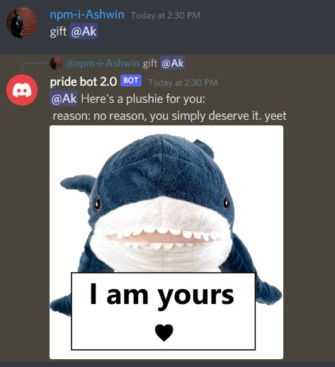
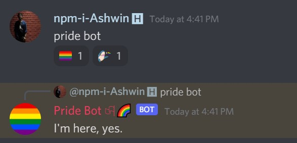
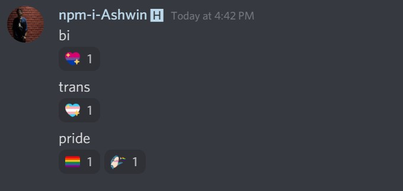

<h1 align="center">Pridebot</h1>
<br>
<p align="center">
  <a href="https://github.com/tyffical/Pridebot/issues"></a>
  <a href="https://github.com/tyffical/Pridebot/network/members"></a>
  <a href="https://github.com/tyffical/Pridebot/stargazers"></a>
  <a href="https://github.com/tyffical/Pridebot/blob/main/LICENSE"></a>
</p>
<p align="center">
  <a href="https://blahaj.lol/discord"></a>
</p>
<p align="center">
  BLAHAJGang's custom-made pride Discord bot that reacts to pride-related messages with pride emojis, as well as some other Blahaj-tastic Easter eggs!
</p>

<details open="open">
<summary>Table of Contents</summary>

- [Invite the Bot](#invite-the-bot)
- [Quickstart](#quickstart)
  - [Local](#local)
    - [Prerequisites](#prerequisites)
    - [Manual Setup](#manual-setup)
  - [On Replit](#on-replit)
- [Contributing](#contributing)
  - [Resources](#resources)
- [Contributors](#contributors)
- [Support](#support)
- [License](#license)
- [Special Thanks](#special-thanks)

</details>

---

## Invite the Bot!

Note: BLAHAJGang-specific emojis will not work unless those emojis are also included in the server and have the same names.

[Click here to invite the bot!](https://discord.com/api/oauth2/authorize?client_id=849471740052504606&permissions=2148002880&scope=bot)

## Quickstart

### Local

#### Prerequisites

- [Python 3.8 and above](https://www.python.org/downloads/)
- [PIP Python Package Manager](https://pip.pypa.io/en/stable/installation/)
- [Git](https://git-scm.com/downloads)
- [A Discord bot](https://discordpy.readthedocs.io/en/stable/discord.html)

#### Manual Setup

1. To run the bot locally, clone and `cd` into the repository.
   ```
   git clone https://github.com/tyffical/Pridebot.git
   cd Pridebot
   ```
2. Create and activate a new Python virtual environment.
   ```
   python3 -m venv venv
   source venv/bin/activate
   ```
3. Install the requirements using `pip`.
   ```
   pip install -r requirements.txt
   ```
4. Copy the `.env.example` file to `.env`, and edit it to include your Discord bot token. Your bot token can be found in the "Bot" settings of your application.
   ```
   cp .env.example .env
   ```
5. Run the main file.
   ```
   python3 main.py
   ```
6. And congratulations! You're good to go!

### On Replit

[](https://repl.it/github/tyffical/Pridebot)

Make sure to add your bot token by clicking on the padlock symbol on the left sidebar, and then inserting "TOKEN" into the `key` text field and your bot token into the `value` text field.

You can turn on the `Always On` setting (found by clicking on the repl name) to keep the bot continuously running!

## Contributing

First off, thanks for taking the time to contribute! Contributions are what makes the open-source community such an amazing place to learn, inspire, and create. Any contributions you make will benefit everybody else and are **greatly appreciated**.

When creating a Github issue, try to create bug reports that are:

- **Reproducible.** Include steps to reproduce the problem.
- **Specific.** Include as much detail as possible: which version, what environment, etc.
- **Unique.** Do not duplicate existing opened issues.
- **Scoped to a Single Bug.** Try to keep one bug per report.

When contributing, make sure to adhere to the [Contributor Covenant Code of Conduct](CODE_OF_CONDUCT.md).

### Resources

Some resources for contributing are listed below:

- Emoji Info https://gist.github.com/scragly/b8d20aece2d058c8c601b44a689a47a0
- Discord.py Documentation https://discordpy.readthedocs.io/en/latest/api.html
- Change Bot Status https://python.plainenglish.io/how-to-change-discord-bot-status-with-discord-py-39219c8fceea
- "Run on repl.it" Button https://replit.com/talk/learn/Configuring-GitHub-repos-to-run-on-Replit-and-contributing-back/23948
- Python Regex Basics https://www.w3schools.com/python/python_regex.asp
- Python Regex Cheatsheet https://cheatography.com/mutanclan/cheat-sheets/python-regular-expression-regex/

#### Discord.py Slash Commands

- https://discord-py-slash-command.readthedocs.io/en/latest/gettingstarted.html
- https://discord-py-slash-command.readthedocs.io/en/latest/discord_slash.context.html
- https://discord-py-slash-command.readthedocs.io/en/latest/gettingstarted.html?highlight=options#more-in-the-option-give-them-a-choice
- https://discord.com/developers/docs/interactions/slash-commands#application-command-object-application-command-option-type

## Maintainers

- Tiffany Trinh (https://tyffic.al)
- Neel Adwani (https://neeltron.com)
- Adam Drummond (https://adamd.fyi/)
- Michael Cao (https://m.omg.lol)

## Other Major Contributors

- Ashwin Kumar Uppala (https://github.com/ashwinexe)

## Support

For support, reach out to us at [our Discord server](https://blahaj.lol/discord) in the #pride-bot-requests-and-contributions channel.

## License

This repository is licensed under the [MIT](https://choosealicense.com/licenses/mit/) license.

## Special Thanks

- Jacklyn Biggin (https://poly.work/jacklynbiggin)
  - Creator of BLAHAJGang &#x2764;&#xFE0F;
- BLAHAJ (https://www.ikea.com/us/en/p/blahaj-soft-toy-shark-90373590/)
  - We wouldn't be a cult without you &#x2764;&#xFE0F;
- BLAHAJGang (https://blahajgang.lol/)
  - For being an awesome community! &#x2764;&#xFE0F;
- The LGBTQ+ Community
  - Happy Pride Month! &#x1F3F3;&#xFE0F;&#x200D;&#x1F308; Thanks for being awesome! &#x2764;&#xFE0F;

---

## Screenshots

Below are some screenshots of Pridebot in action.







---
